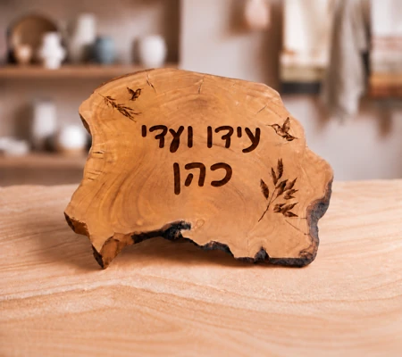

# WUL-005 — דוח בקרת איכות

החלפת תמונת ה־Hero בלבד בנכס המאושר v2 לפי Issue #6. בסיס הענף: `660d4e0fe6f19b11f93d90a28c60e4d19c930a9a` מ־main. אין Merge או פרסום לאתר.

## נכס מקור ונגזרות

קובץ המקור מהחבילה `WUL_005_AGENT_HANDOFF_v2.zip` נשמר ב־[reference/approved-source.png](reference/approved-source.png), בגודל 1330×1183.
SHA-256 אומת: `2bcc3d5827e976e55dcddcdff64760a297e50ea8c995928eac9a44769e55c93b`.
התמונה נפתחה ונבדקה חזותית: שתי שורות החריטה, שתי הציפורים והענף החרוט נשמרים; אין ענף זית פיזי בחזית או לוגו חיצוני.



| נגזרת | מידות | bytes |
|---|---|---|
| hero-approved-v2-small.webp | 640×569 | 52670 |
| hero-approved-v2.webp | 1330×1183 | 135492 |

המרה ב־Pillow, WebP quality=90, method=6; הקטנה ב־Lanczos בלבד. ללא יצירה מחדש, שינוי חריטה, חידוד או החלפת רקע.
קובץ ה־PNG נכלל כראיית מקור בלבד ואינו נטען באתר. `asset-evidence.json` כולל חתימות נגזרות.

## היקף השינוי

- `index.html`: ה־Hero בלבד, srcset/sizes, מידות פנימיות ו־fetchpriority גבוה.
- CSS: שמירת יחס התמונה, contain וריווח צדדי במסגרת הקשת כדי לשמור את כל הלוח.
- מילון השפות: ALT מדויק וכיתוב גלוי `הדמיה להמחשה` / `Illustrative mockup`; הוסר כיתוב הקושר את ההדמיה לצילום בסדנה.
- כל 11 הקבצים הקודמים בתיקיית התמונות נשמרו ללא שינוי לפי SHA-256. כל ה־HTML אחרי מקטע ה־Hero זהה למקור, כולל נתיבי התמונות וכרטיסי המוצרים.
- כלי הבדיקה הקיים מאפשר תיקיית תוצאות נפרדת ואינו דורס את ראיות WUL-003. תוקן בו מרוץ לאחר שינוי viewport: המתנה לאירוע matchMedia שסוגר תפריט, עם timeout רגיל; אין החלשת assertion.

## בדיקות והרצה

```sh
python3 -m http.server 8001 --bind 127.0.0.1 --directory /workspace
# בסשן נוסף, מתוך /workspace/wood-u-like-site:
npm install --cache /tmp/wul-npm-cache --prefix /tmp/wul-check --no-save --no-package-lock playwright@1.62.1 axe-core@4.10.3
NODE_PATH=/tmp/wul-check/node_modules node tools/check-hero.cjs
```

`results.json` מתעד את רגרסיית השפות: 320×568, 390×844, 760×900, 761×900, 768×1024, 844×390, 1024×768, 1440×900, בשתי השפות (16 שילובים), וכן אחסון, סנכרון כרטיסיות, היסטוריה ו־bfcache, אחסון חסום, ללא JavaScript ואתחול איטי.
`hero-results.json` מתעד 10 שילובי הקבלה של ה־Hero, הנכס שנטען, מידות, bytes וזמן טעינה מקומי. הוא בודק גם ALT, כיתוב, contain, עדיפות טעינה והיעדר בקשות PNG.
בדיקות הרגרסיה מכסות ניווט, מקלדת, תפריט, גלילה אופקית, שגיאות JavaScript/HTTP ו־axe-core בתגיות WCAG A/AA שנבחרו.

צילומי פתיחה ועמוד מלא: עברית ואנגלית ב־320, 390, 768, 1440. צילומי Hero נפרדים: כל חמש מידות הקבלה בשתי שפות.

## מחזורי תיקון ומגבלות

מחזור תיקון אחד לכלי הבדיקה לאחר מרוץ תזמון בהרצה חוזרת; אפס תיקוני יישום בעקבות כשל QA. ההרצה הראשונה של 16 השילובים עברה.
בדיקה חזותית אינה OCR או אישור בעל האתר מחדש. ציון 90/100 ואישור המיזוג נשארים לבקרת ראש הצוות.
מדידות הטעינה הן דרך שרת מקומי, ללא הדמיית רשת סלולרית; אין טענה לביצועי GitHub Pages או מדידת שטח. אין build או תלויות runtime לאתר הסטטי.

## תוצאה סופית

PASS: כל 16 שילובי רגרסיית השפה, 5 קבוצות בדיקות נוספות ו־10 בדיקות Hero. אפס הפרות axe בכללים שנבדקו, אפס גלילה אופקית ואפס שגיאות שנבדקו. CLS מרבי: 0.004524 (פחות מ־0.01). זמן משאב Hero מקומי מרבי: 24.40ms. אין בקשות לקובץ PNG. `git diff --check` עבר.
